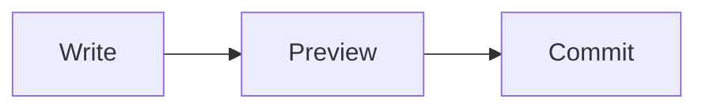

# Markwell Fixture

This fixture exercises tables, code fences, and Mermaid diagrams.

## Table

| Component | Status | Notes |
| --- | --- | --- |
| parser | stable | handles headings, lists, tables |
| cli | active | includes pager and interactive mode |
| app | active | GPUI desktop shell in progress |

## Mermaid



## Code

```rust
fn render(doc: &str) -> String {
    format!("rendered: {doc}")
}
```
